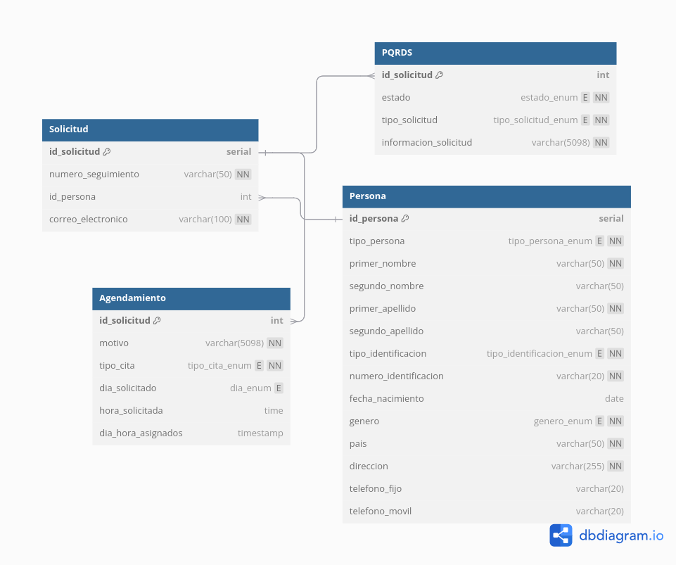

# BASE DE DATOS SOLICITUDES AGENDAMIENTO Y PQRDS

Base de datos relacional con PostgreSQL

## Modelo Logico


## Estructura de Archivos
```
.
├── DDL.sql              # Archivo de definicion de datos y tablas
├── DML.sql              # Archivo de insercion de datos
├── Functions.sql        # Archivo de definicion de funciones
├── StoreProcedures.sql  # Archivo de deficinion procedimientos almacenados
└── Views.sql            # Archivo de definicion de vistas
```

## Iniciar Componente 

Es requerido tener instalado [docker](https://docs.docker.com/get-started/get-docker/)
```sh
# Constuir imagen de docker
docker build -t mi_postgres .

# Ejecutar contenedor
docker run -d \
  --name db_solicitudes \
  -e POSTGRES_DB=db_solicitudes \
  -e POSTGRES_USER=admin \
  -e POSTGRES_PASSWORD=admin \
  -p 5432:5432 \
  --volume postgres_data:/var/lib/postgresql/data \
  mi_postgres
```